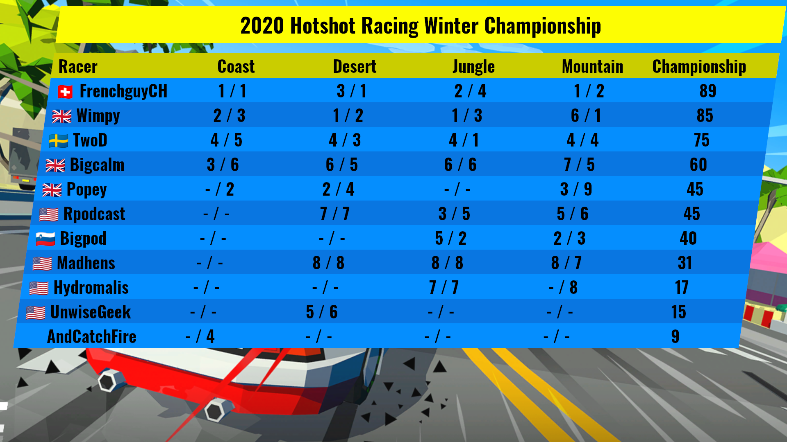

Hotshot Racing Championship Standings generator
===============================================

This GIMP plug-in generates an image of the [Wimpy's World of Linux Gaming](https://www.youtube.com/channel/UC6D0aBP5pnWTGhQAvEmhUNw) Hotshot Racing<sup>[1](#1)</sup> Championship standings.



It reads its data from a text file sorts it, and creates an image.

Pre-requisite
-------------
You will need the font `Oswald-Bold` installed on your system. You can get it for free [from Google Fonts](https://fonts.google.com/specimen/Oswald).

You will also need [GIMP](https://www.gimp.org/), of course.

Installing the script
---------------------

Clone this repository, then copy or symlink `hotshot-generator.py` to your plug-ins folder. You can see what folder(s) GIMP is searching for plug-ins in the `Edit` / `Preferences` dialog : open the `Folders` section, and select `Plug-ins`.

Running the script
------------------

Once the script is copied or symlinked - and GIMP is restarted, if it was running -, go to `File` / `Create` and select `Hotshot Racing standings`. A dialog will pop up, asking for the location of the data file, and the location of the background file. Both files are provided in the repo.

Those options are stored in `hotshot-generator.conf`, so you'll only have to type them once.

The configuration file is either in `$XDG_CONFIG_HOME` or `$HOME/.config` (if you are using the snap, then `XDG_CONFIG_HOME` is defined as `$HOME/snap/gimp/current/.config` at runtime).

The data file
-------------

- The first line is the name of the championship.
- The second line is the list of grand prix
- All subsequent lines are results. Each line has the name of the driver, and the finishing positions for each grand prix, separated by a coma.

```
2020 Hotshot Racing Winter Championship
Coast, Desert, Jungle, Mountain
Wimpy,2,3,1,2,1,3,6,1
FrenchguyCH,1,1,3,1,2,4,1,2
TwoD,4,5,4,3,4,1,4,4
Bigcalm,3,6,6,5,6,6,7,5
Popey,0,2,2,4,0,0,3,9
Rpodcast,0,0,7,7,3,5,5,6
Madhens,0,0,8,8,8,8,8,7
Bigpod,0,0,0,0,5,2,2,3
UnwiseGeek,0,0,5,6,0,0,0,0
Hydromalis,0,0,0,0,7,7,0,8
AndCatchFire,0,4,0,0,0,0,0,0
```

----

<a name="1">1</a> : Hotshot Racing is a blisteringly fast arcade-style racing game fusing drift handling, razor-sharp retro visuals and an incredible sense of speed to create an exhilarating driving experience. Developer : [Sumo Digital Ltd.](https://www.sumo-digital.com/), [Lucky Mountain Games](http://luckymountaingames.co.uk/). Publisher : [Curve Digital](https://www.curve-digital.com/).
